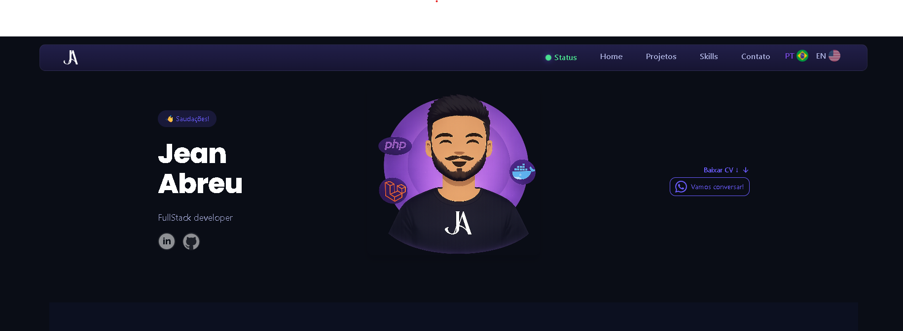
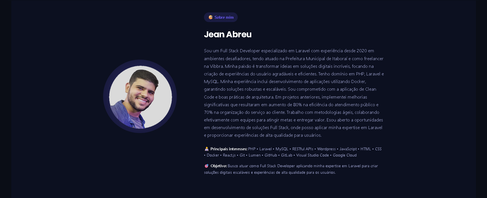
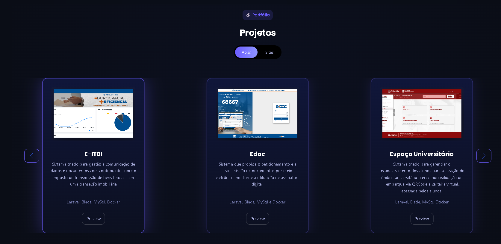
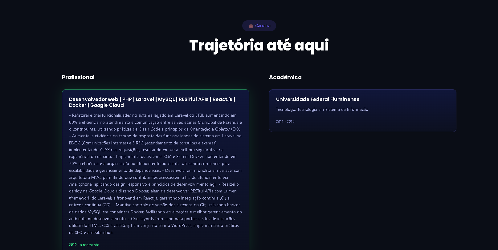
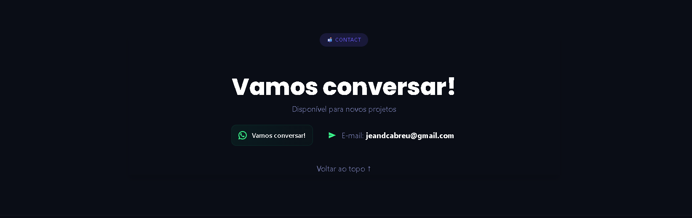

# 🎨 Portfolio Theme - WordPress

Um tema WordPress moderno, responsivo e profissional para portfólio pessoal, construído com **mobile-first design**, acessibilidade completa e performance otimizada.



---

## 📋 Características Principais

### 🎯 Design & UX
- ✅ **Mobile-First**: Desenvolvido começando pelo mobile
- ✅ **Responsivo**: Breakpoints otimizados para tablet e desktop
- ✅ **Dark Mode**: Tema moderno escuro com cores vibrantes (#6B5CFF)
- ✅ **Acessível**: WCAG 2.1 compliant com ARIA labels completos
- ✅ **Animações Suaves**: Transições de 150-400ms com efeitos elegantes
- ✅ **Navegação Moderna**: Menu horizontal com blur effect e status indicator

### 🛠️ Funcionalidades Nativas
- ✅ **Menu Responsivo**: Hamburger mobile + horizontal desktop/tablet
- ✅ **Status Indicator**: Dot animado "Available for work"
- ✅ **Language Switcher**: Integração com GTranslate (com fallback elegante)
- ✅ **7 Seções Completas**: Hero, About, Portfolio, Skills, Career, Recommendations, Contact
- ✅ **Filtros Interativos**: Portfolio e Skills com animações
- ✅ **Timeline de Carreira**: Visualização cronológica elegante
- ✅ **Formulário de Contato**: Com validação e feedback visual
- ✅ **Smooth Scroll**: Navegação fluida entre seções
- ✅ **Lazy Loading**: Carregamento otimizado de imagens
- ✅ **Back to Top**: Botão flutuante para voltar ao topo

### 🔒 Segurança & Qualidade
- ✅ WordPress coding standards rigorosos
- ✅ Nonce verification em todos os forms
- ✅ XSS prevention com esc_* functions
- ✅ CSRF protection integrada
- ✅ HTML5 semântico e acessível
- ✅ ABSPATH check em todos os arquivos

### ⚡ Performance
- ✅ CSS custom properties (variáveis)
- ✅ JavaScript modular e otimizado
- ✅ Intersection Observer para animações scroll-triggered
- ✅ Lazy loading nativo do navegador
- ✅ Otimizado para Core Web Vitals
- ✅ SwiperJS para carrosséis (Portfolio e Recomendações)

---

## 📸 Tour do Sistema

### 🏠 Seção Hero


- Avatar com borda animada
- Título e subtítulo destacados
- Ícones sociais com hover effects
- Status indicator animado "Available for work"
- Background gradient elegante

### 👤 Seção Sobre Mim


- Cards informativos com hover effects
- Avatar com borda animada (#6B5CFF)
- Texto hierarquizado com cores de contraste
- Background secundário (#0C1020)

### 💼 Seção Portfolio


- **Carrossel SwiperJS**: Navegação horizontal suave
- **Filtros por Categoria**: Web, Mobile, Design, etc.
- **Cards de Projetos** com:
  - Hover lift effect
  - Tags coloridas
  - Botão "View Project"
  - Imagens com lazy loading
- Navigation dots e arrows

### 🎯 Seção Skills
- **Filtros Interativos**: Frontend, Backend, Design, Tools
- **Grid de Ícones** animados
- Hover effects com color change
- Divider visual entre grupos

### 📈 Seção Carreira


- **Timeline Interativa** com:
  - Linha vertical contínua
  - Dots animados (#6B5CFF)
  - Cards com hover lift
  - Animações stagger ao aparecer
- Cronograma profissional
- Data, título e descrição

### 💬 Seção Recomendações


- **Carrossel SwiperJS** com:
  - Navigation arrows
  - Pagination dots
  - Auto-play (opcional)
  - Touch swipe
- Cards com quote icon
- Foto do autor, nome e cargo

### 📧 Seção Contato


- Formulário elegante com:
  - Inputs com focus effect
  - Border color change on focus (#6B5CFF)
  - Placeholder colorido
  - Botão com hover effect
- Validação visual
- Feedback de sucesso/erro

---

## 🚀 Guia de Instalação

### Requisitos Mínimos

| Componente | Versão Mínima |
|------------|---------------|
| WordPress | 5.9+ |
| PHP | 7.4+ |
| MySQL | 5.6+ |
| Navegadores | Chrome, Firefox, Safari, Edge (últimas 2 versões) |

### Plugins Recomendados

**Essenciais:**
- **GTranslate** - Tradução automática do site
- **Contact Form 7** - Formulários avançados (opcional, tema tem fallback)

**Opcionais:**
- **WP Super Cache** - Cache do site
- **Smush** - Otimização de imagens
- **Yoast SEO** - SEO otimizado

---

## 📦 Instalação Passo a Passo

### Método 1: Upload Manual

```bash
# 1. Baixar o tema
git clone seu-repo portfolio

# 2. Compactar
zip -r portfolio.zip portfolio/

# 3. Fazer upload via WordPress Admin
# Aparência → Temas → Adicionar Novo → Fazer Upload

# 4. Ativar o tema
# Aparência → Temas → Ativar "Portfolio"
```

### Método 2: Via FTP/SFTP

```bash
# 1. Upload via FTP
scp -r portfolio/ user@server:/var/www/html/wp-content/themes/

# 2. Ativar no WordPress Admin
# Aparência → Temas → Ativar
```

### Método 3: Via Git (Desenvolvimento)

```bash
# 1. Clonar no diretório themes
cd /var/www/html/wp-content/themes/
git clone seu-repo portfolio

# 2. Ajustar permissões
chown -R www-data:www-data portfolio/
chmod -R 755 portfolio/
```

---

## ⚙️ Configuração Inicial

### 1. Criar e Configurar Menu

1. Acesse: **Aparência → Menus**
2. Clique em: **"criar um novo menu"**
3. Nome do menu: **"Menu Principal"**
4. Adicione itens:

| Label | URL/Link |
|-------|----------|
| Home | #home |
| Sobre | #about |
| Portfolio | #portfolio |
| Habilidades | #skills |
| Carreira | #career |
| Recomendações | #recommendations |
| Contato | #contact |

5. Marque: **"Menu Principal"** em Configurações de menu
6. Clique em: **"Salvar Menu"**

### 2. Configurar Logo

1. Acesse: **Aparência → Personalizar → Identidade do Site**
2. Fazer upload da logo
3. **Dimensões recomendadas:**
   - Largura: 120-160px
   - Altura: 32-48px
   - Formato: PNG com transparência ou SVG
4. Clique em: **"Publicar"**

### 3. Configurar GTranslate (Idiomas)

**Opção A: Plugin Recomendado**

1. Acesse: **Plugins → Adicionar Novo**
2. Busque por: **"GTranslate"**
3. Instale e ative o plugin
4. Configure em: **Configurações → GTranslate**

**Se o plugin NÃO estiver instalado:**

- **Para administradores**: Aviso amarelo ⚠️ com link para instalar
- **Para visitantes**: Placeholder elegante mostrando "EN/PT"

### 4. Configurar Status Indicator

Edite o arquivo `templates/components/nav-menu-items.php`:

```php
// Alterar o texto do status
<span class="status-text">Available for Work</span>

// Alterar a cor (em assets/css/core/variables.css)
--menu-status-available: #3cff8f;  // Verde
```

### 5. Personalizar Cores

Edite `assets/css/core/variables.css`:

```css
:root {
    /* Cor principal (roxo) */
    --accent: #6B5CFF;
    --menu-logo: #6B5CFF;
    --home-highlight: #6B5CFF;

    /* Backgrounds */
    --page-bg-primary: #0A0D16;
    --page-bg-secondary: #0C1020;

    /* Texto */
    --text-primary: #ffffff;
    --text-secondary: #a9aedc;

    /* E mais... */
}
```

### 6. Adicionar Conteúdo Real

**Portfolio:**
- Edite `templates/portfolio.php`
- Adicione seus projetos
- Configure categorias (Web, Mobile, Design, etc.)

**Carreira:**
- Edite `templates/career.php`
- Adicione sua experiência profissional

**Contato:**
- Configure email receptor no WordPress
- Use Contact Form 7 ou o formulário nativo

---

## 🎨 Sistema de Navegação

### Estrutura Responsiva

**Mobile (< 768px):**
- Hamburger menu (3 linhas animadas)
- Menu dropdown full-screen com blur
- Overlay semi-transparente
- Fechamento via: botão ×, overlay ou tecla Escape
- Animação slide-in from left

**Tablet (768px - 1024px):**
- Menu horizontal inline
- Logo + Status + Menu + Idioma
- Hover com underline (2px border-bottom)
- Espaçamento médio

**Desktop (1024px+):**
- Menu horizontal premium
- Underline animation suave (::after pseudo-element)
- Espaçamento generoso (32px gap)
- Font-weight: 600

### Componentes da Navegação

```
┌─────────────────────────────────────────────────────┐
│ [Logo]    [Status]  [Menu Links]    [Lang]  [×] │
└─────────────────────────────────────────────────────┘
```

1. **Logo**: Custom WordPress logo ou fallback `</>`
2. **Status Indicator**: Dot animado pulsante
3. **Menu Links**: Navegação principal
4. **Language Switcher**: GTranslate ou placeholder
5. **Hamburger/Close**: Menu mobile

### Efeitos Visuais

- **Blur Effect**: `backdrop-filter: blur(12px)` ao scroll
- **Gradient Background**: Linear gradient vertical
- **Status Animation**: Pulse effect (2s ease-in-out infinite)
- **Hamburger Animation**: Transform X ao abrir menu
- **Link Hover**: Color transition + underline

---

## 📁 Estrutura de Arquivos

```
portfolio/
├── 📄 style.css                      # Arquivo principal do tema
├── 📄 functions.php                  # Configurações do tema
├── 📄 index.php                     # Template principal
├── 📄 header.php                    # Cabeçalho
├── 📄 footer.php                    # Rodapé
│
├── 📁 inc/                          # Configurações
│   ├── theme-setup.php              # Setup do WordPress
│   ├── enqueue.php                  # Assets (CSS/JS)
│   ├── hero-section.php            # Hero customizer
│   ├── about-customizer.php         # About customizer
│   ├── portfolio-customizer.php     # Portfolio customizer
│   ├── skills-customizer.php        # Skills customizer
│   ├── career-customizer.php        # Career customizer
│   ├── recommendations-customizer.php # Recommendations customizer
│   ├── contact-customizer.php      # Contact customizer
│   └── footer-customizer.php       # Footer customizer
│
├── 📁 templates/                    # Templates das seções
│   ├── navigation.php               # Menu wrapper
│   ├── navigation-desktop.php       # Navegação desktop
│   ├── navigation-mobile.php        # Navegação mobile
│   │
│   ├── components/                  # Componentes reutilizáveis
│   │   ├── nav-logo.php           # Logo
│   │   ├── nav-lang.php           # Language switcher
│   │   ├── nav-menu-items.php     # Menu items
│   │   ├── hero-socials.php       # Social links hero
│   │   └── social-links.php       # Social links geral
│   │
│   ├── hero.php                    # Hero section
│   ├── about.php                   # Sobre
│   ├── portfolio.php               # Portfólio
│   ├── skills.php                  # Habilidades
│   ├── career.php                  # Carreira
│   ├── recommendations.php         # Recomendações
│   └── contact.php                 # Contato
│
└── 📁 assets/                       # Assets
    ├── 📁 css/
    │   ├── core/
    │   │   ├── reset.css          # Reset CSS
    │   │   ├── variables.css      # Variáveis (cores)
    │   │   └── typography.css     # Tipografia
    │   │
    │   ├── components/
    │   │   ├── navigation.css     # Navegação (608 linhas)
    │   │   ├── cards.css         # Cards
    │   │   ├── buttons.css       # Botões
    │   │   ├── forms.css         # Formulários
    │   │   └── utilities.css     # Utilitários
    │   │
    │   └── sections/
    │       ├── hero.css           # Hero section
    │       ├── about.css          # About section
    │       ├── portfolio.css      # Portfolio section
    │       ├── skills.css         # Skills section
    │       ├── career.css         # Career section
    │       ├── recommendations.css # Recommendations section
    │       ├── contact.css        # Contact section
    │       └── footer.css        # Footer section
    │
    ├── 📁 js/
    │   ├── main.js               # JS principal (15KB)
    │   ├── carousel-projects.js  # Carousel Portfolio
    │   └── carousel-recommendations.js # Carousel Recomendações
    │
    └── 📁 images/
        └── readme/               # Screenshots
            ├── Menu-hero.png
            ├── about.png
            ├── portfolio.png
            ├── career.png
            ├── recommendations.png
            └── contact.png
```

---

## 🎨 Sistema de Cores

### Variáveis CSS Principais

```css
:root {
    /* Cores Primárias */
    --accent: #6B5CFF;           /* Roxo principal */
    --accent-soft: rgba(107, 92, 255, 0.15);
    --text-primary: #ffffff;      /* Texto branco */
    --text-secondary: #a9aedc;    /* Texto cinza claro */
    --text-muted: #7c82b8;       /* Texto cinza médio */

    /* Backgrounds */
    --page-bg-primary: #0A0D16;  /* Fundo principal */
    --page-bg-secondary: #0C1020;  /* Fundo secundário */
    --page-bg-tertiary: #090B14;  /* Fundo terciário */

    /* Menu */
    --menu-bg: rgba(38, 34, 82, 0.85);
    --menu-bg-blur: rgba(10, 13, 22, 0.8);
    --menu-logo: #6B5CFF;
    --menu-link: #A9AEDC;
    --menu-link-hover: #FFFFFF;
    --menu-link-active: #6B5CFF;
    --menu-divider: #1C2140;
    --menu-status-available: #4ae290; /* Verde status */

    /* Hero */
    --home-bg: #0A0D16;
    --home-title: #FFFFFF;
    --home-subtitle: #9FA5D8;
    --home-highlight: #6B5CFF;
    --home-icons: #6B5CFF;
    --home-icons-muted: #3A3F6B;

    /* Portfolio */
    --portfolio-bg: #0A0D16;
    --portfolio-project-card: #11162B;
    --portfolio-project-card-hover: #151B36;
    --portfolio-tag-bg: #1E2450;
    --portfolio-tag-text: #6B5CFF;
    --portfolio-button-bg: #6B5CFF;

    /* E mais 30+ variáveis... */
}
```

### Paleta de Cores Completa

Consulte `color-scheme.json` para todas as cores do sistema.

---

## 📱 Breakpoints

| Dispositivo | Largura | Características |
|------------|----------|----------------|
| Mobile | < 576px (default) | Hamburger menu, layouts verticais |
| Small Tablet | 576px - 767px | Transição |
| Tablet | 768px - 1023px | **Menu horizontal**, layouts adaptados |
| Small Desktop | 1024px - 1279px | Menu horizontal + underline animado |
| Desktop | 1280px - 1535px | Espaçamento premium |
| Large Desktop | 1536px+ | Full width |

**Ponto crítico:** 768px (menu muda de mobile para horizontal)

---

## 🔧 Personalização Avançada

### Adicionar Nova Seção

1. **Criar template:**
   ```php
   <?php
   // templates/nova-secao.php
   if (!defined('ABSPATH')) { exit; }
   ?>
   <section id="nova-secao" class="nova-secao-section">
       <div class="container">
           <h2>Nova Seção</h2>
           <!-- Conteúdo -->
       </div>
   </section>
   ```

2. **Incluir em index.php:**
   ```php
   <?php get_template_part('templates/nova-secao'); ?>
   ```

3. **Adicionar CSS:**
   ```css
   /* assets/css/sections/nova-secao.css */
   .nova-secao-section {
       background: var(--page-bg-primary);
       padding: var(--spacing-4xl) 0;
   }
   ```

4. **Enqueue CSS:**
   ```php
   // inc/enqueue.php
   wp_enqueue_style('portfolio-nova-secao',
       get_template_directory_uri() . '/assets/css/sections/nova-secao.css',
       array('portfolio-utilities'),
       '1.0.0'
   );
   ```

### Modificar Cores do Tema

Edite `assets/css/core/variables.css`:

```css
:root {
    /* Mudar cor principal de roxo para azul */
    --accent: #3B82F6;
    --menu-logo: #3B82F6;
    --home-highlight: #3B82F6;

    /* Mudar fundo de dark para light */
    --page-bg-primary: #ffffff;
    --text-primary: #1a1a2e;
}
```

### Adicionar JavaScript Personalizado

1. **Criar arquivo:**
   ```javascript
   // assets/js/novo-componente.js
   (function() {
       'use strict';

       const NovoComponente = {
           init: function() {
               console.log('Novo componente iniciado');
           }
       };

       // Adicionar ao Portfolio global
       if (typeof Portfolio !== 'undefined') {
           Portfolio.components.NovoComponente = NovoComponente;
           Portfolio.initNovoComponente = function() {
               Portfolio.components.NovoComponente.init();
           };
       }
   })();
   ```

2. **Enqueue script:**
   ```php
   // inc/enqueue.php
   wp_enqueue_script('portfolio-novo-componente',
       get_template_directory_uri() . '/assets/js/novo-componente.js',
       array('portfolio-main'),
       '1.0.0',
       true
   );
   ```

3. **Inicializar:**
   ```javascript
   // assets/js/main.js - dentro de init()
   this.initNovoComponente();
   ```

---

## 🌐 Funcionalidades JavaScript

### Módulos Disponíveis

```javascript
// Inicializar todos os componentes
Portfolio.init();

// Inicializar módulo específico
Portfolio.initNavigation();        // Menu mobile/desktop
Portfolio.initLanguageSwitcher();   // Language switcher
Portfolio.initScrollEffects();      // Blur ao scroll
Portfolio.initAnimations();         // Scroll-triggered animations
Portfolio.initContactForm();       // Formulário contato
Portfolio.initBackToTop();         // Back to top button
Portfolio.initLazyLoading();       // Lazy loading imagens
```

### Funções Úteis

```javascript
// Smooth scroll para elemento
Portfolio.smoothScrollTo(element);

// Navegação
Portfolio.initNavigation(); // Abre/fecha menu, smooth scroll

// Filtros
Portfolio.initPortfolioFilter(); // Filtra projetos por categoria
Portfolio.initSkillsFilter();   // Filtra skills por categoria
```

---

## 📊 Customizer Options

O tema integra com o **WordPress Customizer** para facilitar personalizações:

### Seções Disponíveis no Customizer

1. **Identidade do Site**
   - Logo do site
   - Título do site
   - Descrição do site
   - Ícone do site

2. **Hero Section** (`inc/hero-customizer.php`)
   - Subtítulo do hero
   - Texto do status (disponibilidade)
   - Links sociais

3. **About Section** (`inc/about-customizer.php`)
   - Título
   - Descrição pessoal
   - Avatar

4. **Portfolio Section** (`inc/portfolio-customizer.php`)
   - Título
   - Subtítulo
   - Projetos (título, descrição, imagem, tags)

5. **Skills Section** (`inc/skills-customizer.php`)
   - Título
   - Categorias
   - Ícones de skills

6. **Career Section** (`inc/career-customizer.php`)
   - Título
   - Experiências (cargo, empresa, período, descrição)

7. **Recommendations Section** (`inc/recommendations-customizer.php`)
   - Título
   - Recomendações (nome, cargo, texto, foto)

8. **Contact Section** (`inc/contact-customizer.php`)
   - Título
   - Email de contato
   - Texto de sucesso

9. **Footer** (`inc/footer-customizer.php`)
   - Texto do footer
   - Links sociais

---

## 🔐 Segurança

### Práticas de Segurança Implementadas

- ✅ **Nonce Verification**: Todos os formulários usam `wp_create_nonce()`
- ✅ **XSS Prevention**: Dados escapados com `esc_html()`, `esc_url()`, `esc_attr()`
- ✅ **CSRF Protection**: Nonce tokens em todas as requisições
- ✅ **ABSPATH Check**: `if (!defined('ABSPATH')) exit;` em todos os arquivos
- ✅ **Sanitization**: Input sanitizado antes de salvar
- ✅ **Output Escaping**: Output escapado ao exibir dados
- ✅ **Database Queries**: Usando $wpdb prepare() quando necessário
- ✅ **File Access**: Sem acesso direto a arquivos PHP

---

## ♿ Acessibilidade

### WCAG 2.1 Compliance

- ✅ **ARIA Labels**: Todos os elementos interativos têm `aria-label`
- ✅ **Screen Readers**: Skip link para pular ao conteúdo
- ✅ **Keyboard Navigation**: Navegação completa por teclado
- ✅ **Focus Indicators**: Estilos de foco visíveis
- ✅ **Contrast Ratio**: WCAG AA+ (4.5:1 mínimo)
- ✅ **Semantic HTML5**: Uso correto de tags semânticas
- ✅ **Image Alt Text**: Todas as imagens têm `alt` atributo
- ✅ **Form Labels**: Todos os inputs têm labels associados
- ✅ **Error Messages**: Mensagens de erro claras e descritivas
- ✅ **Reduced Motion**: Respeita `prefers-reduced-motion`

---

## 📝 Internacionalização

### Text Domain

O tema usa o text domain `portfolio` para tradução:

```php
<?php esc_html_e('Texto traduzível', 'portfolio'); ?>
<?php esc_url__('URL traduzível', 'portfolio'); ?>
<?php esc_attr__('Atributo traduzível', 'portfolio'); ?>
```

### Criar Arquivo de Tradução

```bash
# Gerar arquivo .pot
wp i18n make-pot . languages/portfolio.pot --domain=portfolio

# Criar tradução (ex: Português)
wp i18n make-json languages/ pt_BR --domain=portfolio
```

### Traduzir com G Translate

1. Instalar plugin **G Translate**
2. Acesse: **G Translate → Configurações**
3. Personalizar 
4. Salvar

---

## 🐛 Troubleshooting

### Problemas Comuns

**Menu não aparece:**
- ✅ Verifique se foi criado em Aparência → Menus
- ✅ Verifique se foi atribuído a "Menu Principal"
- ✅ Confirme se links têm âncoras (#hero, #about, etc)

**Estilos não carregam:**
- ✅ Limpar cache do navegador (Ctrl+Shift+Delete)
- ✅ Verificar console para erros CSS/JS
- ✅ Confirmar se assets estão sendo enqueued

**Imagens não aparecem:**
- ✅ Verificar caminho em `get_template_directory_uri()`
- ✅ Confirmar permissões de arquivo (755)
- ✅ Verificar se imagens existem em `assets/images/`

**Formulário não funciona:**
- ✅ Verificar email receptor em Configurações → Geral
- ✅ Confirmar SMTP do servidor
- ✅ Usar Contact Form 7 para formulários avançados

**Carrossel não funciona:**
- ✅ Verificar se SwiperJS está sendo carregado
- ✅ Confirmar IDs dos elementos (swiper-projects, swiper-recommendations)
- ✅ Verificar console para erros JavaScript

**Plugin GTranslate não aparece:**
- ✅ Instalar e ativar plugin GTranslate
- ✅ Configurar em Configurações → GTranslate
- ✅ Se não instalado: admins veem aviso, visitantes veem placeholder

### Debug Mode

Ative debug no `wp-config.php`:

```php
define('WP_DEBUG', true);
define('WP_DEBUG_LOG', true);
define('WP_DEBUG_DISPLAY', false);
```

Logs salvos em: `/wp-content/debug.log`

---

## 📚 Referências

- [WordPress Theme Development](https://developer.wordpress.org/themes/)
- [WordPress Coding Standards](https://developer.wordpress.org/coding-standards/)
- [WCAG 2.1 Guidelines](https://www.w3.org/WAI/WCAG21/quickref/)
- [Mobile First Design](https://www.uxpin.com/studio/blog/a-hands-on-guide-to-mobile-first-design/)
- [SwiperJS Documentation](https://swiperjs.com/)
- [CSS Custom Properties](https://developer.mozilla.org/en-US/docs/Web/CSS/Using_CSS_custom_properties)

---

## 📄 Licença

**GPL v2 ou posterior**

Este tema é software livre: você pode redistribuí-lo e/ou modificá-lo sob os termos da GNU General Public License conforme publicada pela Free Software Foundation.

---

## 👨‍💻 Autor

Desenvolvido como um tema WordPress moderno, responsivo e acessível para portfólios pessoais.

---

## 📊 Estatísticas do Código

| Métrica | Valor |
|---------|-------|
| Total de Arquivos PHP | 30+ |
| Total de Arquivos CSS | 15 |
| Total de Arquivos JS | 3 |
| Linhas de CSS | ~2,500 |
| Linhas de JavaScript | ~500 |
| Linhas de PHP | ~1,500 |
| **Total** | **~4,500 linhas** |

---

## 🎯 Próximas Atualizações (Roadmap)

- [ ] **Light/Dark Mode Toggle** - Switch de tema com persistência
- [ ] **Multi-language Support** - Sistema de tradução completo
- [ ] **Customizer Integration** - Painel de personalização completo
- [ ] **Blog Section** - Adicionar seção de blog/posts
- [ ] **Testimonials Slider** - Slider de depoimentos
- [ ] **PWA Support** - Progressive Web App
- [ ] **Performance Optimization** - Otimizações de Core Web Vitals

---

**Versão**: 2.0.0
**Data de Atualização**: 2026-02-06
**Compatibilidade**: WordPress 5.9+
**PHP**: 7.4+
**Navegadores Suportados**: Chrome, Firefox, Safari, Edge (últimas 2 versões)

---

**🎨 Portfolio Theme** - Transforme seu portfólio em uma experiência visual incrível!
